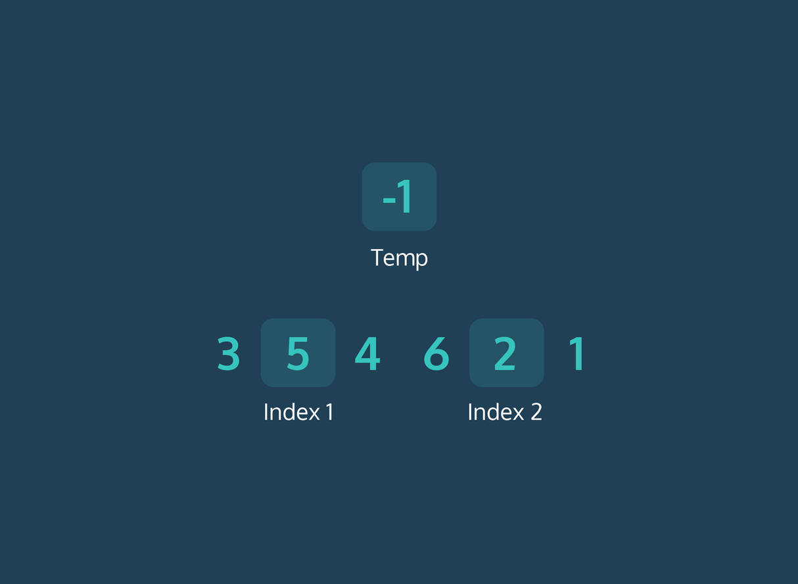
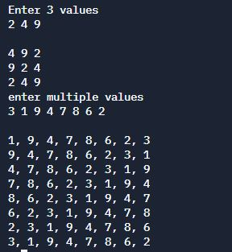

# Circulate the values



## Table of Contents

- [Problem Statement](#problem-statement)
- [Python Code](#python-code)
- [Sample Output](#Sample-Output)
- [Replit Link](#replit-link)
- [PythonTutor Link](#pythontutor-link)

## Problem Statement
<p><div align="justify"> We have taken the input from the user. The user has to provide three inputs that will be assigned the three variables x, y, and z. The values will be later used to get swapped among the variables. In the swapping logic, first, the value of x has been temporarily stored in the variable named temp_var. Then the value of y is assigned to x, and the value of z is assigned to y. At last, the value of temp_var that was having the value of x has been assigned to z, and in following this way, all the three values have been swapped. </div></p>

<p><div align="justify"> When the program runs, it will show all the values that have been assigned to different variables so that we can confirm the values that have been assigned to the variables. Once the swapping is completed after applying the swapping logic, we have shown that in the output screen to ensure that the values have been swapped. </div></p> 
 
**Similarly circulate the N values**

## Python Code
```python
#!/usr/bin/env python3


def circulate(a, b, c):
    """circulate between three variables, three times
    @author kgashok
    @param a is a integer
    @param b is a integer
    @param c is a integer
    @return nothing
    >>> circulate(1, 2, 3)
    2 3 1
    3 1 2
    1 2 3
    """
    i = 3
    while i:
        t = a
        a = b
        b = c
        c = t
        print(a, b, c)
        i -= 1


print("Enter 3 values")
a, b, c = input().split()
print()
circulate(a, b, c)


def circulate_list(alist):
    """circulate 'n' elements in a list, n times
    @author kgashok
    @param alist contains the 'n' elements
    @return nothing
    """
    i = len(alist)
    while i:
        first = alist.pop(0)
        alist.append(first)
        print(*alist, sep=", ")
        i -= 1


alist = input("enter multiple values\n").split()
print()
circulate_list(alist)


if __name__ == "__main__":
    # import doctest
    # doctest.testmod()
    pass
    
```

## Sample Output


## Replit Link
https://tinyurl.com/CirculateTheValues


## PythonTutor Link

https://tinyurl.com/CirculateTheValuesVisualize


