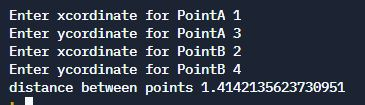

# Distance between two points


## Table of Contents

- [Problem Statement](#problem-statement)

- [Brainstorming](#Brainstorming)

- [Python Code](#python-code)
- [Sample Output](#Sample-Output)
- [Replit Link](#replit-link)
- [PythonTutor Link](#pythontutor-link)
- [Practice Your Solution ](http://cloudcoder.kgkite.ac.in/cloudcoder/#exercise?c=43,p=11914)

## Problem Statement
### Distance between two points
**Write a function to calculate the distance between two points.**

* <p><div align="justify"> To find the distance between two points (x1,y1) and (x2,y2), all that you need to do is use the coordinates of these ordered pairs and apply some common sense. Begin with the most simplest formula and then incrementally arrive at the correct formula as you solve the test cases. </div></p>

* Do it incrementally
    *  <p><div align="justify">Look at the first test case - Point p1 = (0,0) and Point p2 = (4,0). If you mentally apply your mind, the answer is 4. Write the simple formula for this and past the test case. </div></p>
    * <p><div align="justify">Look at the second test case - Point p1 = (4,0) and Point p2 = (0,0). The answer should again be 4. But what does your code calculate the value to? What is the one simple change you will do to make it pass Test case 1 and Test case 2? </div></p>
    * Now, move on to the next test case, and so on.
* Example
    * distance_between((4, 0), (2, 0)) -> 2 
    * distance_between((0, 0), (4, 3)) -> 5 

## Brainstorming
|Question                                                                                                                                                                                                                                                                                                                  |Answer                                                                                                                                                                                                                                                                                                                                                                                                                                                                                                                                                                                                                                                                                                                                                                                                                                                         |
|--------------------------------------------------------------------------------------------------------------------------------------------------------------------------------------------------------------------------------------------------------------------------------------------------------------------------|---------------------------------------------------------------------------------------------------------------------------------------------------------------------------------------------------------------------------------------------------------------------------------------------------------------------------------------------------------------------------------------------------------------------------------------------------------------------------------------------------------------------------------------------------------------------------------------------------------------------------------------------------------------------------------------------------------------------------------------------------------------------------------------------------------------------------------------------------------------|
|<p><strong>Coordinate Geometry Terms</strong></p><p><br></p><p>Coordinate Geometry Definition - It is one of the branches of geometry where the position of a point is defined using coordinates.</p><p><br></p><p>What are the Coordinates?	</p><p><br></p>                                                              |<p><span style="color: rgb(238, 236, 246); background-color: rgb(40, 45, 88);">What are the Coordinates?</span></p><p><br></p><p><span style="color: rgb(238, 236, 246); background-color: rgb(40, 45, 88);"><span class="ql-cursor"></span>Coordinates are a set of values which helps to show the exact position of a point in the coordinate plane.</span></p>                                                                                                                                                                                                                                                                                                                                                                                                                                                                                             |
|<p>Coordinate Plane Meaning	- A coordinate plane is a 2D plane which is formed by the intersection of two perpendicular lines known as the x-axis and y-axis.</p><p><br></p><p>What is the <strong>Distance Formula</strong>?</p>                                                                                         |<p><span style="background-color: rgb(40, 45, 88); color: rgb(238, 236, 246);">What is the </span><span style="color: rgb(226, 148, 20); background-color: rgb(40, 45, 88);">Distance Formula</span><span style="background-color: rgb(40, 45, 88); color: rgb(238, 236, 246);">?</span></p><p><br></p><p><span style="background-color: rgb(40, 45, 88); color: rgb(238, 236, 246);"><span class="ql-cursor"></span></span>It is used to find the distance between two points situated in <strong>A(x1,y1)</strong> and <strong>B(x2,y2)</strong></p><p><br></p>                                                                                                                                                                                                                                                                                             |
|<p>What is the most logical way to represent a cartesian point in Python?</p><p><br></p><p>A. Use two variables, for e.g.  x1 and y1  or x2 and y2 </p><p>B. Use a single tuple variable</p><p>C. <strong>None</strong> of the above</p>                                                                                  |<p><strong>Choice B. </strong></p><p><strong>Tuple</strong> is the logical way of representing a point in Python.</p>                                                                                                                                                                                                                                                                                                                                                                                                                                                                                                                                                                                                                                                                                                                                          |
|<p>What is the <a href="https://en.wikipedia.org/wiki/Syntax_(programming_languages)" rel="noopener noreferrer" target="_blank">syntax</a> for defining a point <code>(3, 4)</code> as a tuple in Python? </p><p><br></p><p>A. <code>(3, 4)</code></p><p>B. <code>tuple(3, 4)</code></p><p>C. Both the above are valid</p>|<p><strong>Choice C. </strong></p><p><br></p><p><strong>(3, 4) </strong>and<strong> tuple(3, 4) </strong>are equivalent to each other.</p><p><br></p>                                                                                                                                                                                                                                                                                                                                                                                                                                                                                                                                                                                                                                                                                                         |
|<p>How can you deconstruct a <strong>tuple</strong> that represents a point?</p><p><br></p>                                                                                                                                                                                                                               |<p>How do you deconstruct a tuple? </p><p><br></p><p>If</p><p><code>pointA = (6, 8) # construction</code></p><p><br></p><p>then</p><p><code>x1, y1 = pointA # deconstruction</code></p><p><code>print(x1, y1)   # 6, 8 </code></p>                                                                                                                                                                                                                                                                                                                                                                                                                                                                                                                                                                                                                             |
|<p><code>x1, y1, x2, y2 = (1, 2, 3, 4)</code></p><p><br></p><p>What is the value of <code>x1</code> and <code>y2</code>?</p>                                                                                                                                                                                              |<pre class="ql-syntax" spellcheck="false">1 and 4. </pre>                                                                                                                                                                                                                                                                                                                                                                                                                                                                                                                                                                                                                                                                                                                                                                                                      |
|<p>What is the distance between (4, 0) and (0, 0)?</p><p><br></p><p></p>                                                                                                                                                       |<p><strong>4</strong></p><p><br></p><p><code class="ql-font-monospace" style="background-color: rgb(49, 56, 114); color: rgb(208, 204, 238);">d = (x1 - x2)</code></p><p><code class="ql-font-monospace" style="background-color: rgb(49, 56, 114); color: rgb(208, 204, 238);">  = 4 - 0 </code></p><p><code class="ql-font-monospace" style="background-color: rgb(49, 56, 114); color: rgb(208, 204, 238);">  = 4 </code></p>                                                                                                                                                                                                                                                                                                                                                                                                                               |
|<p>What is the distance between (4, 3) and (4, 0)?</p><p><br></p><p><br></p><p></p>                                                                                                               |<p><strong>3</strong></p><p><br></p><p><code>d = (x1 - x2) + (y1 - y2) </code></p><p><code>  = (4 - 4) + (3 - 0) </code></p><p><code>  = 0 + 3</code></p><p><code>  = 3</code></p>                                                                                                                                                                                                                                                                                                                                                                                                                                                                                                                                                                                                                                                                             |
|<p>What is the distance between (4, 3) and (0, 0)?</p><p><br></p><p></p>                                                                                                                          |<p>Using previous formula, we get </p><p><br></p><p><code style="background-color: rgb(49, 56, 114); color: rgb(208, 204, 238);">d = (x1 - x2) + (y1 - y2) </code></p><p><code style="background-color: rgb(49, 56, 114); color: rgb(208, 204, 238);">  = (4 - 0) + (3 - 0) </code></p><p><code style="background-color: rgb(49, 56, 114); color: rgb(208, 204, 238);">  = 4 + 3</code></p><p><code style="background-color: rgb(49, 56, 114); color: rgb(208, 204, 238);">  = 7</code></p><p><br></p><p>But we know from <a href="https://www.mathsisfun.com/algebra/distance-2-points.html" rel="noopener noreferrer" target="_blank">https://www.mathsisfun.com/algebra/distance-2-points.html</a> </p><p><br></p><p></p><p><br></p>|
|<p>If (x1 - x2) + (y1 - y2) is giving a higher value than what is correct,</p><p><br></p><p>What can the <strong>distance formula</strong> be? </p>                                                                                                                                                                       |<p>Why not square the x component and square the y component, and then reduce it down by using square root?</p><p><br></p><p>The distance formula is as follows:</p><p><br></p><p></p>                                                                                                                                                                                                                                                                                                                                                                                                                                                                                                                                                                                          |
|<p>What is the distance between <strong>(2, -1)</strong> and <strong>(5, 3)</strong>?</p>                                                                                                                                                                                                                                 |<p></p>


## Python Code
```python
from math import sqrt


def distance_between(pointA, pointB):
    x1, y1 = pointA
    x2, y2 = pointB

    distx = x1 - x2
    disty = y1 - y2

    return sqrt(distx**2 + disty**2)


# main program
# tuple packing allows for assigning
# multiple inputs in one statement
pointA = int(input("Enter xcordinate for PointA ")), \
    int(input("Enter ycordinate for PointA "))

pointB = int(input("Enter xcordinate for PointB ")), \
    int(input("Enter ycordinate for PointB "))

print("distance between points", distance_between(pointA, pointB))

```
## Sample Output


## Replit Link
https://tinyurl.com/DistBwTwoValues


## PythonTutor Link

https://tinyurl.com/DisBwTwoValuesVisualize

## Practice Your Solution

<p>Are you confident of writing the code for <strong>Distance between Two Points? </strong></p><p></strong></p>                                                                                                                      <p>Test yourself at <a href="http://j.mp/twoPoints" rel="noopener noreferrer" target="_blank">http://j.mp/twoPointsCC</a></p>
