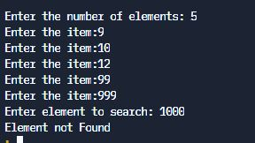

# Binary search function


## Table of Contents

- [Problem Statement](#problem-statement)
- [Python Code](#python-code)
- [Sample Output](#Sample-Output)
- [Replit Link](#replit-link)
- [PythonTutor Link](#pythontutor-link)

## Problem Statement
* <div align="justify"> <p> The idea behind the binary search is that we can first divide the array into two halves, and compare the element we’re searching for (call it x) with the element in the middle (call it m) that divides the two halves of the array. </div></p> 
* <div align="justify"> <p>Since the array is sorted, we know that if x>m, then we only need to continue searching in the right half of the original array because the list is given to be sorted. </div></p> 
* If x<m, then we only need to continue earching in the left half of the original array.
* <div align="justify"> <p> We can recursively continue this process until either the value is found, or if the interval is empty (meaning that x was not in our original array). </div></p> 


## Python Code
```python
def binarySearch(alist, token):
    while alist:
        mid=len(alist)//2
        midvalue=alist[mid]
        if midvalue is token:
            return True
        alist=alist[:mid] if token<midvalue else alist[mid+1:]
    return False


# Main Program
num_list = []
n = int(input("Enter the number of elements"))
for i in range(0, n):
    item = input("Enter the item:")
    num_list.append(item)
search = input("Enter element to search: ")
ans = binarySearch(num_list, search)
if(ans):
    print("Element Found")
else:
    print("Element not Found")

```

## Sample Output


## Replit Link
https://tinyurl.com/BinarySearchRepl

## PythonTutor Link

https://tinyurl.com/KiTEBinarySearchVisual

