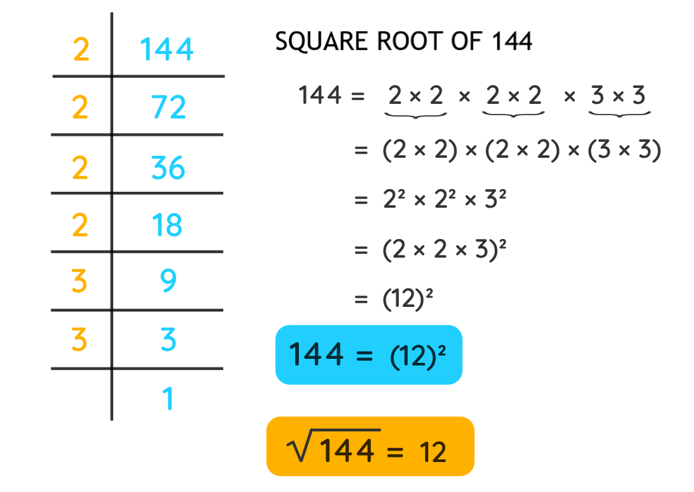

# Finding Square Root of the Number



## Table of Contents

- [Problem Statement](#problem-statement)
- [Python Code](#python-code)
- [Sample Output](#Sample-Output)
- [Replit Link](#replit-link)
- [PythonTutor Link](#pythontutor-link)


## Problem Statement
<div align="justify"> <p>Square root of a number is an inverse operation of squaring a number. The Square of a number is the value of power 2 of the number, while the square root of a number is the number that we need to multiply by itself to get the original number. If 'a' is the square root of 'b', it means that a×a=b. </div> </p>

<div align="justify"> <p>The square root of a number is the value of power 1/2 of that number. In other words, it is the number that we multiply by itself to get the original number. It is represented using the symbol '√ '.</div> </p>

## Python Code

```python
# importing math module
import math
# Function definition


def square_root(n):
    a = math.sqrt(n)
    print('the square root of a number is ', a)


# Main program
n = int(input("enter a number:"))
square_root(n)
```

## Sample Output


## Replit Link
https://tinyurl.com/SquareRootReplit

## PythonTutor Link

https://tinyurl.com/SquareRootVisualize

