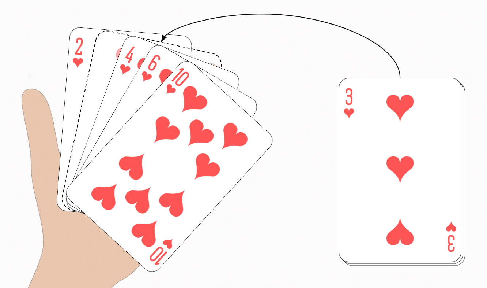

# Insert a card in a list of sorted cards


## Table of Contents

- [Problem Statement](#problem-statement)
- [Python Code](#python-code)
- [Sample Output](#Sample-Output)
- [Replit Link](#replit-link)
- [PythonTutor Link](#pythontutor-link)

## Problem Statement

<div align="justify"> Playing cards are one of the techniques of sorting and the steps are shown as follows:
Start with an empty left hand and cards face down on the table. Then remove one card at a time from the table and Insert it into the correct  position in the left hand. To find a correct position for a card, we compare it with each of the cards already in the hand from left to right. Once the position is found, the cards from that position are moved to the next higher indexed position and in that order. New card is inserted at the current position. </div> 

## Python Code

```python
order = {
    'A': 1, '2': 2, '3': 3, '4': 4,
    '5': 5, '6': 6, '7': 7, '8': 8,
    '9': 9, '10': 10,
    'J': 11, 'Q': 12, 'K': 13
}


def insertCard(deck, newCard):
    for card in deck:
        if order[card] > order[newCard]:
            index = deck.index(card)
            deck.insert(index, newCard)
            break
    return deck


deck = ['2', '5', '8', '10', 'J', 'K']  # initial set of cards
print("deck = ", deck)
newCard = input("Enter the new card to be inserted:")  # get the new card
insertCard(deck, newCard)
print(deck)

```

## Sample Output


## Replit Link

https://cutt.ly/InsertACard


## PythonTutor Link


https://cutt.ly/InsertACardVisual


