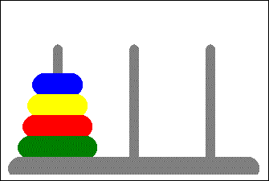
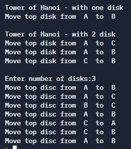

# Tower of Hanoi


## Table of Contents

- [Problem Statement](#problem-statement)
- [Python Code](#python-code)
- [Sample Output](#Sample-Output)
- [Replit Link](#replit-link)
- [PythonTutor Link](#pythontutor-link)

## Problem Statement

**The mission is to move all the disks to some another tower without violating the sequence of arrangement.**
_A few rules to be followed for Tower of Hanoi are_

- Only one disk can be moved among the towers at any given time.
- Only the "top" disk can be removed.
- No large disk can sit over a small disk.

**Tower of Hanoi puzzle with n disks can be solved in minimum 2n−1 steps**

## Python Code

```python
# Tower of Hanoi

# one disk is tower A, destination is tower B, intermediate is tower C
print("Tower of Hanoi - with one disk")
source = 'A'
destination = 'B'
print("Move top disk from ", source, " to ", destination)
print()

# Two disk is at tower A, destination is tower B, intermediate in tower C
print("Tower of Hanoi - with 2 disk")
source = 'A'
destination = 'B'
temp = 'C'
print("Move top disk from ", source, " to ", temp)
print("Move top disk from ", source, " to ", destination)
print("Move top disk from ", temp, " to ", destination)
print()


# In a recursive way

def tower_of_hanoi(n, fromTower, toTower, tempTower):
    if n == 1:
        print("Move top disc from ", fromTower, " to ", toTower)
    else:
        # Move n-1 disks from source to temp
        tower_of_hanoi(n - 1, fromTower, tempTower, toTower)
        # Move top disk from source to destination
        print("Move top disc from ", fromTower, " to ", toTower)
        # Move n-1 disks from temp to the destination
        tower_of_hanoi(n - 1, tempTower, toTower, fromTower)


n = int(input("Enter number of disks:"))
tower_of_hanoi(n, 'A', 'B', 'C')

```
## Sample Output



## Replit Link
https://cutt.ly/TowerOfHanoi


## PythonTutor Link


https://tinyurl.com/KiTETowerOfHanoi


