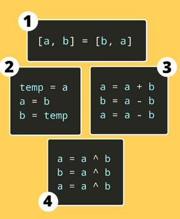

# Swap the values


## Table of Contents

- [Problem Statement](#problem-statement)
- [Python Code](#python-code)
- [Sample Output](#python-code)
- [Replit Link](#replit-link)
- [PythonTutor Link](#pythontutor-link)
- [Bonus Material](#Bonus-Material)

## Problem Statement
 

<div align="justify"><p>Given two variables x and y, write a Python program to swap their values. </p></div>


## Python Code

```python
print("Enter two values to swap")
a = int(input())
b = int(input())

print("Before Swapping a is ",a," b is ",b)
# using a temporary variable
print("Swapping using temporary variable...")
t = a
a = b
b = t
print("Value of a is {a} and\nValue of b is {b}".format(a=a, b=b))

print("Before Swapping a is ",a," b is ",b)
# using XOR operator, eliminating the need for 3rd variable
print("Swapping using XOR operator...")
a = a ^ b
b = a ^ b
a = a ^ b
print("Value of a is {a} and\nValue of b is {b}".format(a=a, b=b))

print("Before Swapping a is ",a," b is ",b)
def swap_func():
    global a, b
    print("swap_func function called")
    a, b = b, a


swap_func()  # a and b are swapped again
print("Value of a is {a} and\nValue of b is {b}".format(a=a, b=b))

print("Before Swapping a is ",a," b is ",b)
# using a Addition and difference
print("Swapping using Addition and difference...")
a = a + b
b = a - b
a = a - b
print("Value of a is {a} and\nValue of b is {b}".format(a=a, b=b))

```
## Sample Output


## Replit Link
https://tinyurl.com/SwapTheValues


## PythonTutor Link

https://tinyurl.com/SwapTheValuesVisualize

## Bonus Material

[https://www.geeksforgeeks.org/python-program-to-swap-two-variables/](https://www.geeksforgeeks.org/python-program-to-swap-two-variables/)