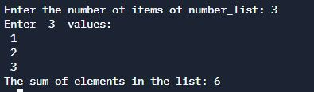

# Sum of elements in an array


## Table of Contents
- [Problem Statement](#problem-statement)
- [Python Code](#python-code)
- [Sample Output](#Sample-Output)
- [Replit Link](#replit-link)
- [PythonTutor Link](#pythontutor-link)

## Problem Statement
<div align="justify"> <p> In this program, we need to calculate the sum of all the elements of an array. This can be solved by looping through the array and add the value of the element in each iteration to variable sum.

Program to print the sum of all the elements of an array
Sum of all elements of an array is 1 + 2 + 3 + 4 + 5 = 15. </div> </p>

## Python Code

```python
# Function to add items of the list
def add(numlst):
    sum = 0
    for i in numlst:
        sum = sum + i
    return sum


# Main Program
number_list = []
n = int(input("Enter the number of items of number_list: "))
print("Enter ", n, " values:")
for i in range(0, n):
    x = int(input(" "))
    number_list.append(x)
print("The sum of elements in the list:", add(number_list))

```

## Sample Output


## Replit Link
https://tinyurl.com/SumOfElementsArray

## PythonTutor Link

https://tinyurl.com/SumOfElementsVisualize

