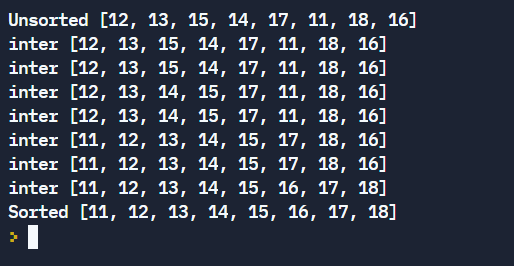

# Insertion Sort


## Table of Contents

- [Problem Statement](#problem-statement)
- [Python Code](#python-code)
- [Sample Output](#Sample-Output)
- [Replit Link](#replit-link)
- [PythonTutor Link](#pythontutor-link)


## Problem Statement

<div align="justify"> <p> Insertion sort is a simple sorting algorithm that works similar to the way you sort playing cards in your hands. The array is virtually split into a sorted and an unsorted part. Values from the unsorted part are picked and placed at the correct position in the sorted part.  </div></p>


To sort an array of size n in ascending order: 
* Iterate from arr[1] to arr[n] over the array. 
* Compare the current element (key) to its predecessor. 
* <div align="justify"> <p> If the key element is smaller than its predecessor, compare it to the elements before. Move the greater elements one position up to make space for the swapped element. </div></p>


## Python Code

```python
def insertionsort(alist):
    '''insertionsort algorithm implemented
    using insort function
    '''
    for i in range(1, len(alist)):
        key = alist[i]
        insort(alist, key, i)
        print("inter", alist)
    return alist


def insort(alist, key, j):
    '''insort inserts 'key' into the
    sorted alist[:j] so that it remains sorted
    'j' is the current index of 'key' in alist
    '''
    while j > 0 and alist[j - 1] > key:
        alist[j] = alist[j - 1]
        j -= 1
    alist[j] = key

```

## Sample Output


## Replit Link
https://tinyurl.com/InsertionSortReplit

## PythonTutor Link

https://tinyurl.com/InsertionSortVisualize
